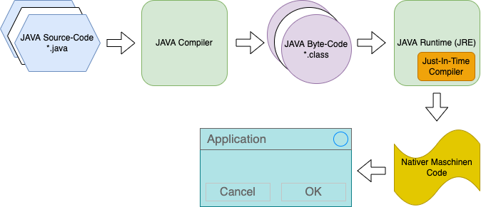

# Einführung in Java + Installation von Java JDK und IntelliJ IDEA für Java

- Java ist eine der beliebtesten Programmiersprachen, da sie in verschiedenen technischen Bereichen wie App-Entwicklung, Web-Entwicklung, Client-Server-Anwendungen usw. verwendet wird.
- Java ist eine objektorientierte Programmiersprache, die 1991 von Sun Microsystems entwickelt wurde.
- Sie wurde ursprünglich von James Goslin als Oak bezeichnet. Er war einer der Erfinder von Java.
- Java = rein objektorientiert.

## Wie funktioniert Java?
- Der Quellcode in Java wird zunächst in den Bytecode kompiliert.
- Anschließend kompiliert die Java Virtual Machine (JVM) den Bytecode in den Maschinencode.

## Java Installation:

### Schritt 1: JDK herunterladen
- JDK steht für Java Development Kit. Es enthält die Java Virtual Machine(JVM) und die Java Runtime Environment(JRE).
- JDK - Java Development Kit ist eine Sammlung von Tools, die für die Entwicklung und Ausführung von Java-Programmen verwendet werden.
- JRE - Java Runtime Environment führt die in JAVA entwickelten Programmen aus.
- [Klicke hier](https://adoptium.net/de/download/), und du wirst auf die Download-Seite von ADOPTIUM weitergeleitet.
- Wähle dein Betriebssystem und lade die Installations-Datei, für die `JAVA Version 17.0.5 LTS`, herunter.

### Schritt 2: Installation des JDK
- Sobald die ausführbare Datei erfolgreich heruntergeladen wurde, klicke mit der rechten Maustaste auf die Datei um sie zu öffnen.
- Die Installation wird nun ausgeführt.
- Klicke weiterhin auf die Schaltfläche Weiter, um das JDK mit den Standardeinstellungen zu installieren.

### Schritt 3: Herunterladen von IntelliJ IDEA
- Wir brauchen eine integrierte Entwicklungsumgebung (IDE), um unseren Code zu schreiben und zu debuggen.
- IntelliJ IDEA ist die am besten geeignete IDE für das Schreiben von Java-Code.
- Klicke hier](https://www.jetbrains.com/idea/download), und du wirst zur offiziellen Download-Seite von IntelliJ IDEA weitergeleitet.
- Lade die aktuelle Community-Version von IntelliJ IDEA herunter, da sie kostenlos ist.

### Schritt 4: Installation von IntelliJ IDEA
- Sobald der Download abgeschlossen ist, öffne die Installations-Datei um den Installationsprozess zu starten.
- Klicke auf die Schaltfläche Weiter, um IntelliJ IDEA am Standardspeicherort zu installieren.
- Vergesse nicht, ein Häkchen bei `Add launchers dir to the PATH`, zu setzen.
