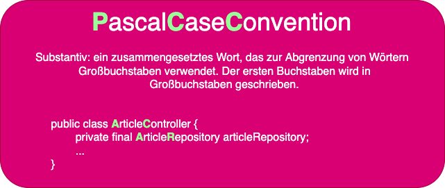
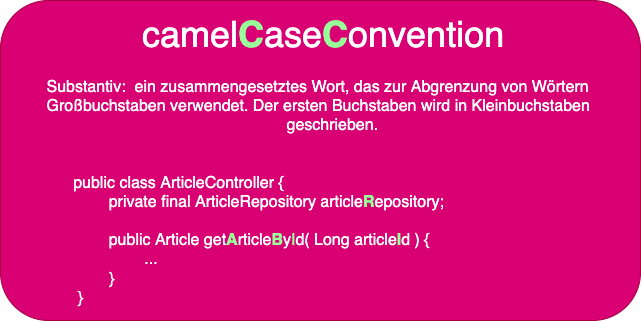

# Die Grundstruktur eines Java-Programms

## Grundlegende Struktur eines Java-Programms

```java
// Gruppenklassen (Package)
package schwarz.it.lws.java._001_002_basic_structure_of_java_programm;

// Einstiegspunkt in die Anwendung
public class App{

    // Einstiegspunkt in die Anwendung
	public static void main(String[]args){
        // Standard Ausgabe auf der Konsole
		System.out.println("JAVA is awesome!");
	}
}
```

## Arbeitsweise des oben gezeigten "App"-Programms

### 1. package schwarz.it.lws.java._001_002_basic_structure_of_java_programm
- Pakete werden verwendet, um verwandte Klassen zu gruppieren.
- Das Schlüsselwort "Package" wird verwendet, um Pakete in Java zu erstellen.
- Hier ist schwarz.it.lws.java._001_002_basic_structure_of_java_programm der Name unseres Pakets.
- In Java, ein Package-Name wird auf folgende Weise gebildet:
  - Wähle einen Namen für das Package, der eindeutig und leicht zu merken ist. 
  - Der Name sollte auch in einem speziellen Format geschrieben werden, das bestimmte Regeln befolgt. 
    - Der Name wird in Kleinbuchstaben geschrieben und darf keine Leerzeichen oder Sonderzeichen enthalten. 
    - Es hat sich bewährt als Basis Package-Name die umgedrehte Domain Adresse des Unternehmens zu verwenden
      - Ein Beispiel: `lidl.com` wird zu `com.lidl`. So wird ein eindeutiger Gruppenname gebildet.  

### 2. public class App
- In Java muss jedes Programm eine Klasse enthalten, Java ist eine objektorientierte Programmiersprache.
- Der Dateiname und der Name der Klasse muss identisch sein, sofern vor dem Bezeichner `class` der Sichtbarkeits-Modifizierer `public` steht.
- Hier haben wir eine Klasse namens "App" erstellt.

### 3. public static void main(String[]args){..}
- Dies ist die main()-Methode unseres Java-Programms.
- Jedes Java-Programm muss eine main()-Methode enthalten.

### 4. System.out.println("Hallo Welt")
- Der obige Code wird verwendet, um die Ausgabe auf der Konsole anzuzeigen.
- Alles, was innerhalb der Anführungszeichen steht, wird als reiner Text ausgegeben.
- Die Methode `println` ist eine statische Methode `System` Klasse.

### 5. Benennungskonventionen

Für Klassen verwenden wir die Pascal-Konvention. Das erste und die nachfolgenden Zeichen eines Wortes sind Großbuchstaben (Uppercase).



Beispiel: Main, MyScanner, MyEmployee, CodeWithKonrad

Für Funktionen und Variablen verwenden wir die Camel-Case-Convention. Hier ist das erste Zeichen ein Kleinbuchstabe, und die folgenden Zeichen sind Großbuchstaben, wie myScanner, myMarks, codeWithKonrad



### 6. Kommentare
- In Java gibt es einzeilige und mehrzeilige Kommentare.
- Einzeilige Kommentare beginnen mit `//` und enden mit dem Zeilenende. Bsp: `//insert your code here`
- Mehrzeilige Kommentare beginnen mit `/*`, können sich über eine odere mehrere Zeilen erstrecken und enden mit `*/`.
- Ein Java Doc-Kommentar ist ein spezieller Typ von mehrzeiligen Kommentaren. Diese Kommentare werden in der Regel verwendet, um Dokumentation für eine Klasse, Methode oder anderen Teil des Codes zu erstellen. Java Doc-Kommentare beginnen in der Regel mit einem `/**` und enden mit einem `*/`. Innerhalb des Kommentars werden bestimmte Tags verwendet, um Informationen über den Code zu beschreiben, z.B. die Parameter einer Methode oder dem Rückgabewert einer Funktion. Die Java Doc-Kommentare können dann von Tools wie dem JavaDoc-Generator verwendet werden, um automatisch eine Dokumentation für den Code zu erstellen.