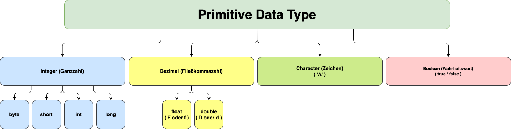

# Datentypen, Variablen Literale und Schlüsselwörter

- Genauso wie wir Regeln in der deutschen Sprache haben (die Grammatik), gibt es auch Regeln, die wir beim Schreiben
  eines Java-Programms befolgen müssen. Die Gesamtheit dieser Regeln wird Syntax genannt. Es ist wie Vokabular und
  Grammatik von Java.

### Variablen

- Eine Variable ist ein Container, der einen Wert speichert.
- Dieser Wert kann während der Ausführung des Programms geändert werden.
- Bsp: int number = 42; (`int` ist ein Datentyp, `number` ist der Variablenname, und 42 ist der Wert, den sie
  enthält/speichert).

### Regeln für die Deklaration eines Variablennamens

- Bei der Deklaration einer Java-Variablen müssen bei der Namenswahl folgende Regeln beachtet werden:
    - Der Name darf nicht mit einer Ziffer beginnen. (z.B. 1lws ist eine ungültige Variable).
    - Der Name unterscheidet Groß- und Kleinschreibung. (SchwarzIt und schwarzIt sind unterschiedlich).
    - Darf kein Schlüsselwort sein (wie class, while, switch, ...).
    - Leerzeichen sind nicht erlaubt. (int Code with Konrad ist ungültig).
    - Kann Alphabete, $-Zeichen, _-Zeichen und Ziffern enthalten, wenn die anderen Bedingungen erfüllt sind.

### Datentypen

Die Datentypen in Java lassen sich in die folgenden Kategorien einteilen

- Primitive Datentypen (intrinsisch)
- Referenz Datentypen, die Nicht-primitive Datentypen (abgeleitet von der Basisklasse Object)

### Primitive Datentypen

Java ist streng statisch typisiert, d.h. Variablen müssen vor der Verwendung deklariert werden. In Java gibt es 8
primitive Datentypen: boolean, byte, char, short, int, long, float und double. Diese Datentypen werden verwendet, um die
grundlegenden Werte zu speichern, die von einem Java-Programm verwendet werden. Die Primitive-Datentypen unterscheiden
sich in ihrer Größe und dem von ihnen unterstützten Wertebereich.

| Typ       | Größe (in Byte)  | Wertebereich                                             |
|-----------|------------------|----------------------------------------------------------|
| `byte`    | 1                | -128 bis 127                                             |
| `short`   | 2                | -32.768 bis 32.767                                       |
| `int`     | 4                | -2.147.483.648 bis 2.147.483.647                         |
| `long`    | 8                | -9.223.372.036.854.775.808 bis 9.223.372.036.854.775.807 |
| `float`   | 4                | Gleitkommazahl mit einfacher Genauigkeit                 |
| `double`  | 8                | Gleitkommazahl mit doppelter Genauigkeit                 |
| `char`    | 2                | Ein Unicode-Zeichen (16 Bit)                             |
| `boolean` | 1 (JVM-abhängig) | `true` oder `false`                                      |

Beachte, dass dieser Wertebereich für jeden der Primitive Datentypen festgelegt ist und nicht verändert werden kann.
Wenn du Werte speichern möchtest, die außerhalb dieses Bereichs liegen, muss ein anderer Datentyp verwendet werden.

### Wie wählt man Datentypen für unsere Variablen aus?

Um den Datentyp zu wählen, müssen wir zunächst den Typ der Daten finden, die wir speichern wollen. Danach müssen wir den
Minimal- und Maximalwert analysieren, den wir verwenden möchten.



## Literale in Java

### Literale

- Ein konstanter Wert, der einer Variablen zugewiesen werden kann, wird als Literal bezeichnet.
- 101 - Integer-Literal
- 10.1f - Float-Literal
- 10.1 - Double-Literal (Standardtyp für Dezimalzahlen)
- A" - Zeichenliteral
- true - Boolesches Literal
- "Schwarz IT" - String-Literal

```
package schwarz.it.lws.java._001_003_datatyps_variables_litarals_and_keywords;

public class App {
    public static void main(String[] args) {
        boolean isYear2000LeapYear = true;
        byte age = 42;
        short count = 84;
        int articleId = 56;
        long secondsSince1970 = System.currentTimeMillis() / 1000L;;
        char charOfAsciiCode65 = 'A';
        float price = 5.6f;
        double priceless = 4.66;
    }
}
```

### Schlüsselwörter

Wörter, die reserviert sind und vom Java-Compiler verwendet werden. Sie können nicht als Bezeichner verwendet werden.
Die folgende Übersicht zeigt die Schlüsselwörter bis Version 17.

- `abstract` - Ein Nicht-Zugriffsmodifikator. Wird für Klassen und Methoden verwendet: Eine abstrakte Klasse kann
  nicht verwendet werden, um Objekte zu erstellen (um auf sie zuzugreifen, muss sie von einer anderen Klasse geerbt
  werden). Eine abstrakte Methode kann nur in einer abstrakten Klasse verwendet werden, und sie hat keinen Körper. Der
  Körper wird von der Unterklasse bereitgestellt (geerbt von)
- `assert` - Zur Fehlersuche
- `boolean` - Ein Datentyp, der nur wahre und falsche Werte (true,false) speichern kann
- `break` - Bricht aus einer Schleife oder einem Switch-Block aus
- `byte` - Ein Datentyp, der ganze Zahlen von -128 und 127 speichern kann
- `case` - Markiert einen Code-Block in einer Switch-Anweisungen
- `catch` - Fängt Ausnahmen ab, die durch try-Anweisungen erzeugt werden
- `char` - Ein Datentyp, der verwendet wird, um ein einzelnes Zeichen zu speichern
- `class` - Definiert eine Klasse
- continue` - Setzt die nächste Iteration einer Schleife fort
- `const` - Definiert eine Konstante. !Nicht in Gebrauch - stattdessen final verwenden
- `default` - Legt den Standard-Codeblock in einer switch-Anweisung fest
- `do` - Wird zusammen mit while verwendet, um eine do-while-Schleife zu erzeugen
- `double` - Ein Datentyp, der ganze Zahlen von 1,7e-308 bis 1,7e+308 speichern kann
- `else` - Wird in bedingten Anweisungen verwendet
- `enum` - Deklariert einen enumerierten (unveränderlichen) Aufzählungstyp
- `exports` - Exportiert ein Paket mit einem Modul. Neu in Java 9
- `extends` - Erweitert eine Klasse (zeigt an, dass eine Klasse von einer anderen Klasse geerbt wird)
- `final` - Ein Nicht-Zugriffs-Modifikator, der für Klassen, Attribute und Methoden verwendet wird und sie
  unveränderbar macht (unmöglich zu erben oder zu überschreiben)
- `finally` - Wird bei Ausnahmen verwendet, ein Codeblock, der ausgeführt wird, unabhängig davon, ob eine Ausnahme
  vorliegt oder nicht
- `float` - Ein Datentyp, der ganze Zahlen von 3,4e-038 bis 3,4e+038 speichern kann
- `for` - Erzeugt eine for-Schleife
- `goto` - Wird nicht verwendet und hat keine Funktion
- `if` - Erzeugt eine bedingte Anweisung
- `implements` - Implementiert eine Schnittstelle (Interface)
- `import` - Wird verwendet, um ein Paket, eine Klasse oder ein Interface zu importieren
- `instanceof` - Prüft, ob ein Objekt eine Instanz einer bestimmten Klasse oder eines Interfaces ist
- `int` - Ein Datentyp, der ganze Zahlen von -2147483648 bis 2147483647 speichern kann
- `interface` - Wird verwendet, um einen speziellen Typ von Klasse zu deklarieren, der nur abstrakte Methoden enthält
- `long` - Ein Datentyp, der ganze Zahlen von -9223372036854775808 bis 9223372036854775808 speichern kann
- `module` - Deklariert ein Modul. Neu in Java 9
- `native` - Gibt an, dass eine Methode nicht in der gleichen Java-Quelldatei implementiert ist (sondern in einer
  anderen Sprache)
- `new` - Erzeugt neue Objekte
- `package` - Deklariert ein Paket
- `private` - Ein Zugriffsmodifikator, der für Attribute, Methoden und Konstruktoren verwendet wird und sie nur
  innerhalb der deklarierten Klasse zugänglich macht
- `protected` - Ein Zugriffsmodifikator, der für Attribute, Methoden und Konstruktoren verwendet wird, so dass sie im
  gleichen Paket und in Unterklassen zugänglich sind
- `public` - Ein Zugriffsmodifikator, der für Klassen, Attribute, Methoden und Konstruktoren verwendet wird und sie
  für jede andere Klasse zugänglich macht
- `requires` - Gibt die erforderlichen Bibliotheken innerhalb eines Moduls an. Neu in Java 9
- `return` - Beendet die Ausführung einer Methode und kann verwendet werden, um einen Wert aus einer Methode
  zurückzugeben
- `short` - Ein Datentyp, der ganze Zahlen von -32768 bis 32767 speichern kann
- `static` - Ein Nicht-Zugriffsmodifikator, der für Methoden und Attribute verwendet wird. Auf statische
  Methoden/Attribute kann zugegriffen werden, ohne ein Objekt einer Klasse zu erzeugen
- `strictfp` - Schränkt die Genauigkeit und Rundung von Fließkommaberechnungen ein
- `super` - Verweist auf Objekte der Oberklasse (Eltern)
- `switch` - Wählt einen von vielen Codeblöcken aus, der ausgeführt werden soll
- `synchronized` - Ein Nicht-Zugriffsmodifikator, der angibt, dass nur ein Thread gleichzeitig auf Methoden zugreifen
  kann
- `this` - Verweist auf das aktuelle Objekt in einer Methode oder einem Konstruktor
- `throw` - Erzeugt einen benutzerdefinierten Fehler
- `throws` - Gibt an, welche Ausnahmen von einer Methode ausgelöst werden können
- `transient` - Ein Nicht-Zugriffs-Modifikator, der angibt, dass ein Attribut nicht Teil des dauerhaften Zustands
  eines Objekts ist
- `try` - Erzeugt eine try...catch-Anweisung
- `var` - Deklariert eine Variable. Neu in Java 10
- `void` - Gibt an, dass eine Methode keinen Rückgabewert haben soll
- `volatile` - Gibt an, dass ein Attribut nicht thread-lokal zwischengespeichert wird, sondern immer aus dem "
  Hauptspeicher" gelesen wird
- `while` - Erzeugt eine while-Schleife


