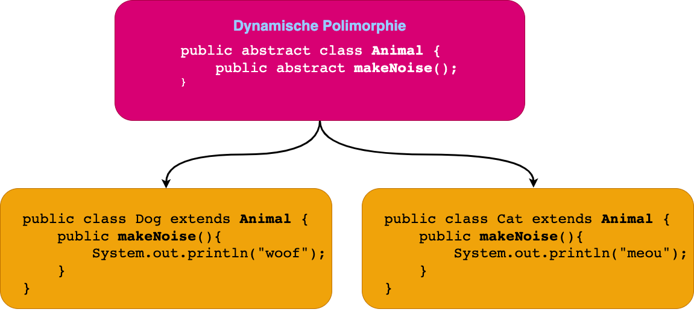
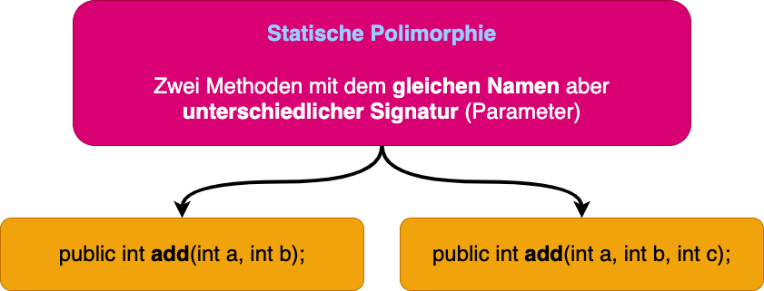

## Vererbung

In Java (und in anderen objektorientierten Sprachen) sind Vererbung und Polymorphismus wichtige Konzepte, die es
ermöglichen, den Code zu strukturieren und zu wiederverwenden.

Vererbung:

Vererbung ist das Verhältnis zwischen zwei Klassen, bei dem eine Klasse (die sogenannte Unterklasse oder Subklasse) die
Eigenschaften und Methoden einer anderen Klasse (die sogenannte Basisklasse oder Superklasse) übernimmt. Die
Unterklasse "erbt" somit die Eigenschaften und Methoden der Basisklasse und kann diese verwenden. Zusätzlich kann die
Unterklasse ihre eigenen Eigenschaften und Methoden definieren und die Eigenschaften und Methoden der Basisklasse
überschreiben oder ergänzen.

Die Vererbung ermöglicht es, den Code zu wiederverwenden und die Struktur des Programms zu vereinfachen. Sie wird häufig
verwendet, um allgemeine Funktionalitäten in einer Basisklasse zu definieren und spezifischere Funktionalitäten in
Unterklassen auszulagern.

Hier ist ein Beispiel für die Verwendung von Vererbung in Java:

```java
public class Animal {
    // Eigenschaften und Methoden für alle Tiere
}

public class Dog extends Animal {
    // Eigenschaften und Methoden für Hunde, die die Eigenschaften und Methoden der Animal-Klasse erben
}

public class Cat extends Animal {
    // Eigenschaften und Methoden für Katzen, die die Eigenschaften und Methoden der Animal-Klasse erben
}
```

## Polymorphismus

Polymorphismus ist die Fähigkeit, dass eine Klasse oder ein Objekt mehrere Formen annehmen kann. In Java gibt es zwei
Arten von Polymorphismus: __dynamischen__ Polymorphismus und __statischen__ Polymorphismus.

### Dynamischer Polymorphismus:

Dynamischer Polymorphismus wird in Java durch die Verwendung von Interfaces und abstrakten Klassen erreicht. Eine
abstrakte Klasse kann Methoden enthalten, die nicht implementiert sind (d.h. sie haben keine Implementierung, sondern
nur eine Methodenkopfzeile). Die Unterklassen einer abstrakten Klasse müssen diese Methoden implementieren. Ein
Interface ist eine spezielle Art von Klasse, die nur Methodenkopfzeilen enthält und keine Implementierungen. Jedes
Interface muss von einer Klasse implementiert werden, die die Methoden des Interfaces implementiert.

Der dynamische Polymorphismus ermöglicht es, dass mehrere Klassen die gleiche Methode haben, die aber unterschiedlich
implementiert sind. Dies wird durch die Verwendung von Polymorphismus erreicht, indem man eine Referenz auf ein
Interface oder eine abstrakte Klasse anstelle einer Referenz auf eine konkrete Klasse verwendet. Die tatsächliche
Implementierung der Methode wird dann zur Laufzeit aufgerufen, je nachdem, welche konkrete Klasse tatsächlich verwendet
wird.



Hier ist ein Beispiel für die Verwendung von __dynamischem Polymorphismus__ in Java:

```java
abstract class Animal {
    public abstract void makeNoise();
}

public class Dog extends Animal {
    @Override
    public void makeNoise() {
        System.out.println("woof");
    }
}

class Cat extends Animal {
    @Override
    public void makeNoise() {
        System.out.println("meow");
    }
}

class App {
    public static void main(String[] args) {
        Animal dog = new Dog();
        dog.makeNoise(); // Gibt "woof" aus

        Animal cat = new Cat();
        cat.makeNoise(); // Gibt "meow" aus
    }
}
```

### Statischer Polymorphismus

Statischer Polymorphismus ist eine Art von Polymorphismus, bei dem die tatsächliche Methode, die aufgerufen wird, zur
Compile-Zeit bestimmt wird, anstatt zur Laufzeit wie beim dynamischen Polymorphismus.

In Java wird statischer Polymorphismus durch die Verwendung von Methodenüberladung erreicht. Die Methodenüberladung
ermöglicht es, dass mehrere Methoden den gleichen Namen haben, aber unterschiedliche Parameterlisten. Die tatsächliche
Methode, die aufgerufen wird, wird zur Compile-Zeit aufgrund der Parameter, die übergeben werden, bestimmt.



Hier ist ein Beispiel für die Verwendung von statischem Polymorphismus in Java:

```java
class Calculator {
    public int add(int a, int b) {
        return a + b;
    }

    public int add(int a, int b, int c) {
        return a + b + c;
    }
}

class App {
    public static void main(String[] args) {
        Calculator calculator = new Calculator();
        int result1 = calculator.add(1, 2);    // Ruft die erste add-Methode auf
        int result2 = calculator.add(1, 2, 3); // Ruft die zweite add-Methode auf
    }
}
```

### [INHALT](../README.md)
