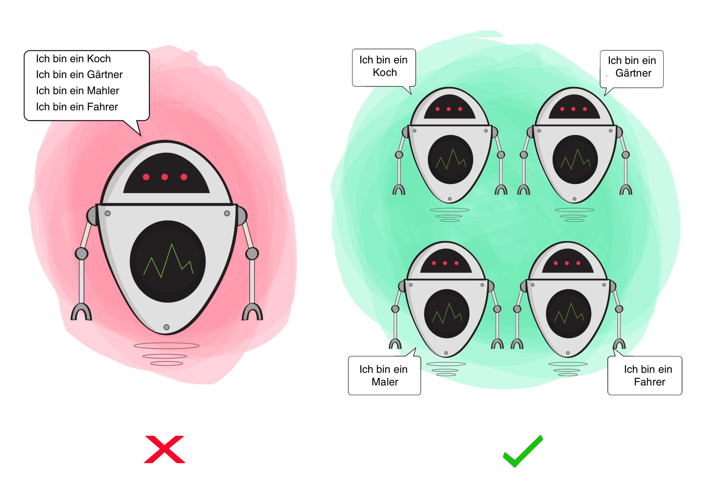
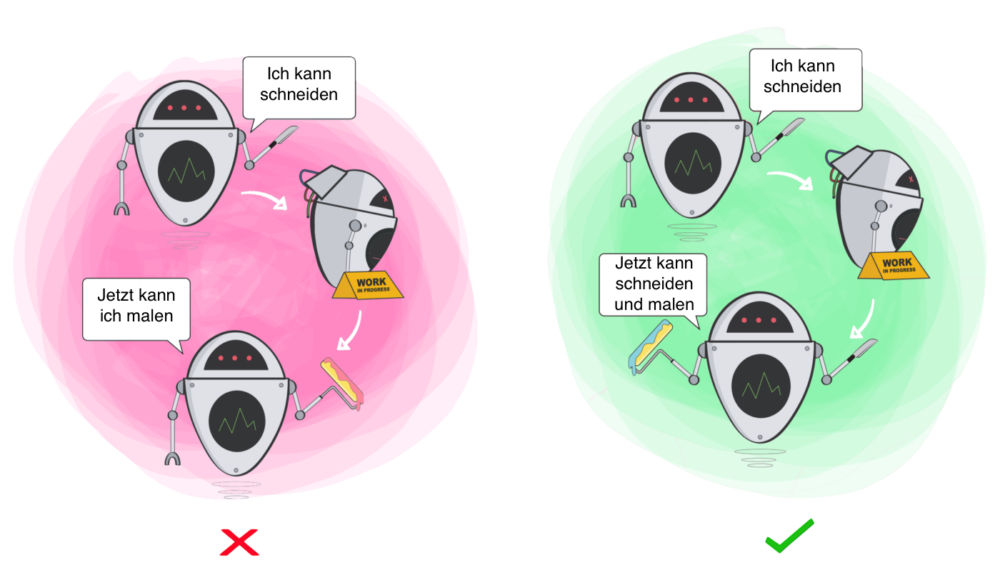
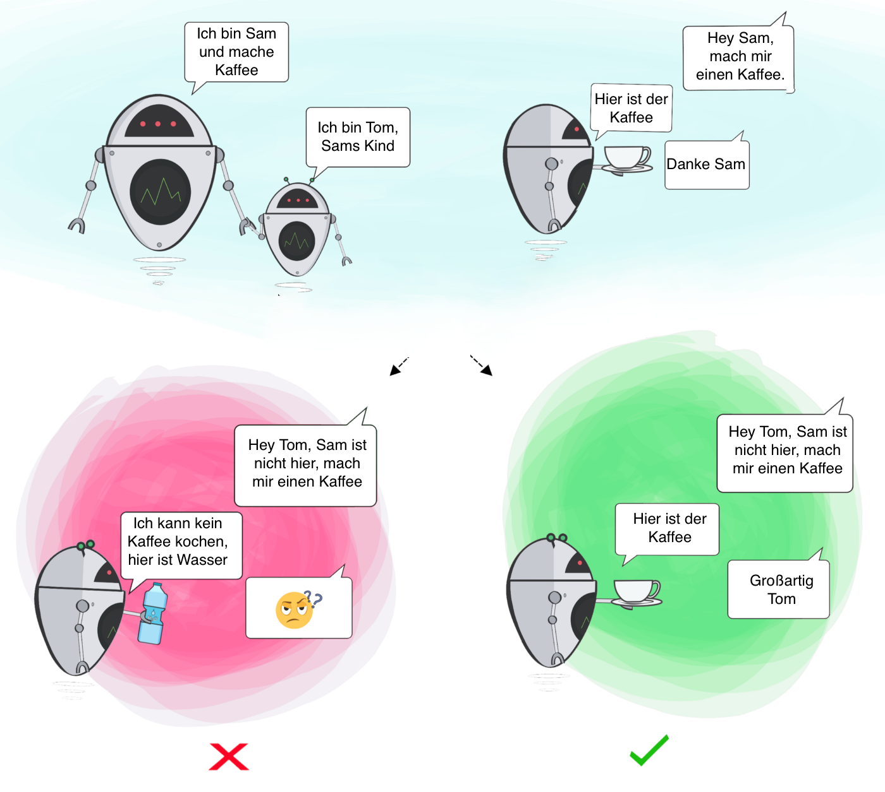
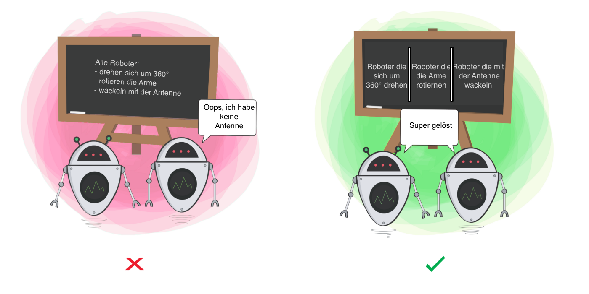
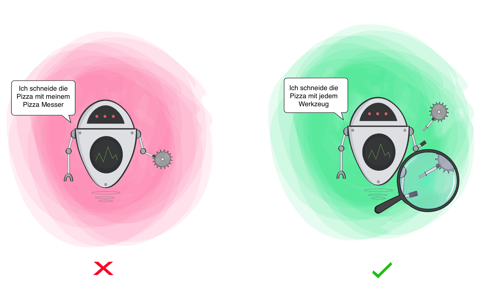

# Die SOLID-Prinzipien – Fünf Grundsätze für bessere Software

Die Qualität der Software ist nicht in allen Projekten ideal. Der Einsatz von
Software-Engineering soll den Code in all seinen Aspekten verbessern. Mit diesen
fünf Prinzipien kommen Sie dem Ziel näher. Denn guter Code motiviert!

Immer wieder hört man Aussage wie: „Warum sollte ich überhaupt guten Code schreiben?
Interessiert doch eh keinen. Hauptsache, das Projekt ist abgeschlossen!“.
Ein großer Teil der Programmierer gibt sich mit schlechtem Quellcode zufrieden,
ganz nach dem Motto: „Was willst Du denn, es läuft doch?!“

## Doch der Preis von schlechtem Code ist hoch

> Hoher Wartungsaufwand
> Hohe Kosten für die Weiterentwicklung
> Aufwändige Fehlersuche

Die interne Qualität des Codes trägt also langfristig zu einer Reduzierung
der Gesamtkosten bei.

## Warum ist guter Code noch wichtig?

- Code schreiben ist ein relativ kleiner Teil der Softwareentwicklung. Etwa 80%
  der Kosten entfallen auf die anschließende Wartung.

- Es wird wenig neuer Code geschrieben. Die hauptsächliche Arbeit besteht aus Änderungen.
  Der größte Anteil an der Arbeit ist nicht das Codieren, sondern das Verstehen (Lesen) von Code.

- Fehlerbehebungen in unverständlichem Code erzeugen schnell neue Fehler.

- Wenn am Anfang des Projektes auf Kosten der Codequalität Zeit gespart wird, wird dies
  am Ende des Projektes ein Vielfaches der eingesparten Zeit kosten.

Prinzipiell ist jedem (erfahrenen) Entwickler bekannt, dass schlechter Code die Arbeit
behindert. Allerdings passiert es immer wieder, dass aufgrund von hohem Druck chaotischer
Code geschrieben wird, damit Termine eingehalten werden können.

Doch das funktioniert nicht. Der schlechte Code führt dazu, dass die Arbeit langsamer vorangeht
und Termine nicht eingehalten werden. Es gibt nur einen Weg: von Anfang sauberen Code schreiben!

## Was ist sauberer Code?

- Sauberer Code ist leichter lesbar.

- Andere Entwickler können ihn besser lesen und verstehen.

- Klassen und Methoden sind auf die Erfüllung einer Aufgabe ausgerichtet und werden nicht durch
  Nebenaufgaben „verunreinigt“.

- Die Abhängigkeiten zu anderem Code sind auf ein Minimum begrenzt.

- Sauberer Code ist gut zu testen.

- Es gibt keine Duplizierungen.

- Der Code enthält keine Überraschungen.

## Guter Code motiviert

- Alle Beteiligten sind stolz auf ihre Arbeit.

- Das Programmieren macht mehr Spaß.

- Der Code enthält weniger Fehler.

- Guter Code ist einfacher zu testen.

Für den Mitarbeiter im Projekt heißt das: Guter Code reduziert unangenehme Arbeit.

## Die Checkliste für sauberen Code

Um die Erstellung guten Codes zu erleichtern, wurden mehrere Prinzipien für
die Softwareentwicklung formuliert. Diese können als eine Art Checkliste gesehen
werden, die in der täglichen Arbeit des Entwicklers als Hilfe dienen, die eigene
Arbeit zu reflektieren bzw. von vornherein Fehler und kritische Konstrukte zu vermeiden.

Prominente Vertreter solcher Prinzipien sind die SOLID-Prinzipien. SOLID wurde
von Robert C. Martin geprägt.

Es ist ein Akronym und steht für:

- S Single-Responsibility-Prinzip
- O Open-Closed-Prinzip
- L Liskovsches Substitutionsprinzip
- I Interface-Segregation-Prinzip
- D Dependency-Inversion-Prinzip

Wenn diese Prinzipien eingehalten werden, entsteht besserer Code, und die Software
wird besser wartbar.

## Das Single-Responsibility-Prinzip


Das Single-Responsibility-Prinzip besagt, dass eine Klasse nur eine Verantwortlichkeit
haben soll. Änderungen an der Funktionalität sollen nur Auswirkungen auf wenige Klassen
haben. Je mehr Code geändert werden muss, desto höher ist das Fehlerrisiko.

Hält man sich nicht an dieses Prinzip, verursacht das zu viele Abhängigkeiten und hohe
Vernetzung. Das ist wie im wirklichen Leben: Ab einer bestimmten Größe wird ein
Universalwerkzeug unhandlich.

### Wie kann erkannt werden, ob die Klasse mehr als eine Aufgabe erfüllt?

Die Klasse darf nur einen Grund zur Änderung haben. Wenn sich zwei Anforderungen ändern,
darf nur eine davon eine Auswirkung auf die Klasse haben. Hat die Klasse mehrere
Änderungsgründe, erfüllt sie zu viele Aufgaben.

Es ist also besser, viele kleine Klassen zu haben als wenige große.

Der Code wird dadurch nicht umfangreicher – er wird nur anders organisiert. Analogie
aus dem Bastelkeller: Wenn alle Schrauben in einer Kiste liegen, ist es schwer,
die Richtige zu finden. Sind sie gut sortiert auf mehrere Schachteln verteilt, geht
das Suchen viel schneller. Genauso verhält es sich mit den Klassen.

Hier ist ein Beispiel für eine Klasse, die gegen das Single Responsibility Principle verstößt:

```java
class Employee {
    private String name;
    private String email;
    private String phoneNumber;

    public Employee(String name, String email, String phoneNumber) {
        this.name = name;
        this.email = email;
        this.phoneNumber = phoneNumber;
    }

    public String getName() {
        return name;
    }

    public String getEmail() {
        return email;
    }

    public String getPhoneNumber() {
        return phoneNumber;
    }

    public void saveToDatabase() {
        // Code to save employee to database
    }
}
```

In diesem Beispiel hat die Employee-Klasse sowohl die Verantwortung für die Repräsentation eines Mitarbeiters als auch
für dessen Speicherung in der Datenbank. Dies verstößt gegen das Single Responsibility Principle, da die Klasse zwei
Verantwortungen hat.

Es wäre besser, die Speicherung von Mitarbeitern in der Datenbank in eine separate Klasse auszulagern, z.B.
EmployeeService, wie im vorherigen Beispiel gezeigt. Dann wäre die Employee-Klasse nur für die Repräsentation von
Mitarbeitern verantwortlich und die EmployeeService-Klasse nur für die Speicherung von Mitarbeitern in der Datenbank.

Hier ist ein für das Single Responsibility Principle in Java:

```java
class Employee {
    private String name;
    private String email;
    private String phoneNumber;

    public Employee(String name, String email, String phoneNumber) {
        this.name = name;
        this.email = email;
        this.phoneNumber = phoneNumber;
    }

    public String getName() {
        return name;
    }

    public String getEmail() {
        return email;
    }

    public String getPhoneNumber() {
        return phoneNumber;
    }
}

class EmployeeService {
    public void saveEmployee(Employee employee) {
        // Code to save employee to database
    }
}
```

In diesem Beispiel ist die Employee-Klasse verantwortlich für die Repräsentation eines Mitarbeiters und die Speicherung
ihrer Eigenschaften (Name, E-Mail und Telefonnummer). Die EmployeeService-Klasse ist verantwortlich für die Speicherung
von Mitarbeitern in der Datenbank.

## Das Open-Closed-Prinzip


Nach dem Open-Closed-Prinzip soll eine Klasse offen für Erweiterungen, aber geschlossen
gegenüber Modifikationen sein. Das Verhalten einer Klasse darf erweitert, aber nicht
verändert werden. Dieses Prinzip hilft, Fehler in schon fertigen Codeteilen zu vermeiden.
Wenn eine Erweiterung nur durch Änderungen innerhalb einer Klasse erreicht werden kann,
ist die Gefahr sehr groß, dass durch die Änderung schon fertig implementierte Funktionen
neue Fehler bekommen.

Das Open-Closed-Prinzip lässt sich normalerweise über zwei Wege erreichen:

- Vererbung

- Einsatz von Interfaces

Durch Einhalten dieses Prinzips können einer Applikation neue Funktionen hinzugefügt
werden, ohne bestehende Klassen zu verändern.

Hier ist ein Beispiel für eine Klasse, die gegen das Open-Closed Principle verstößt:

```java
class Circle {
    private double radius;

    public Circle(double radius) {
        this.radius = radius;
    }

    public double getRadius() {
        return radius;
    }
}

class Rectangle {
    private double width;
    private double height;

    public Rectangle(double width, double height) {
        this.width = width;
        this.height = height;
    }

    public double getWidth() {
        return width;
    }

    public double getHeight() {
        return height;
    }
}

class ShapeCalculator {
    public double calculateTotalArea(Object[] objects) {
        double totalArea = 0;
        for (Object object : objects) {
            if (object instanceof Circle) {
                Circle circle = (Circle) object;
                totalArea += Math.PI * circle.getRadius() * circle.getRadius();
            } else if (object instanceof Rectangle) {
                Rectangle rectangle = (Rectangle) object;
                totalArea += rectangle.getWidth() * rectangle.getHeight();
            }
        }
        return totalArea;
    }
}
```

In diesem Beispiel muss man die ShapeCalculator-Klasse ändern, wenn man neue Shape-Klassen hinzufügen möchte. Man muss
z.B. eine neue if-Anweisung hinzufügen, um die neue Shape-Klasse zu behandeln. Das verstößt gegen das Open-Closed
Principle, da die Klasse für Änderungen geöffnet ist.

Es wäre besser, wenn die ShapeCalculator-Klasse die Shape-Schnittstelle verwenden würde, wie im vorherigen Beispiel
gezeigt. Dann könnte man neue Shape-Klassen hinzufügen, ohne die ShapeCalculator-Klasse ändern zu müssen.

Hier ist ein einfaches Beispiel für das Open-Closed Principle in Java:

```java
interface Shape {
    double getArea();
}

class Circle implements Shape {
    private double radius;

    public Circle(double radius) {
        this.radius = radius;
    }

    @Override
    public double getArea() {
        return Math.PI * radius * radius;
    }
}

class Rectangle implements Shape {
    private double width;
    private double height;

    public Rectangle(double width, double height) {
        this.width = width;
        this.height = height;
    }

    @Override
    public double getArea() {
        return width * height;
    }
}

class ShapeCalculator {
    public double calculateTotalArea(Shape[] shapes) {
        double totalArea = 0;
        for (Shape shape : shapes) {
            totalArea += shape.getArea();
        }
        return totalArea;
    }
}
```

In diesem Beispiel gibt es eine Shape-Schnittstelle und zwei Klassen, die von dieser Schnittstelle implementieren:
Circle und Rectangle. Die ShapeCalculator-Klasse verwendet die getArea-Methode, die von der Shape-Schnittstelle
bereitgestellt wird, um das Gesamtflächenmaß aller Shapes zu berechnen.

Das Open-Closed Principle wird hier erfüllt, da man neue Shape-Klassen hinzufügen kann, ohne die ShapeCalculator-Klasse
ändern zu müssen. Man müsste nur die neue Shape-Klasse implementieren und die getArea-Methode implementieren, um die
neue Funktionalität hinzuzufügen.

## Das Liskovsche Substitutionsprinzip


Das Liskovsche Substitutionsprinzip fordert, dass abgeleitete Klassen immer anstelle
ihrer Basisklasse einsetzbar sein müssen. Subtypen müssen sich so verhalten wie ihr
Basistyp. Das klingt selbstverständlich, aber ist es das auch? Der Compiler weiß,
dass eine abgeleitete Klasse auch vom Typ der Basisklasse ist – also immer in diese
konvertiert werden kann. Ist das ausreichend? Das Liskovsche Substitutionsprinzip
geht weiter als der Compiler.

Hier ist ein Beispiel, in dem das Liskovsche Substitutionsprinzip verletzt wird:

```java
interface Animal {
    void makeSound();
}

class Dog implements Animal {
    @Override
    public void makeSound() {
        System.out.println("Woof!");
    }
}

class Cat implements Animal {
    @Override
    public void makeSound() {
        System.out.println("Meow!");
    }
}

class AnimalTrainer {
    public void train(Animal animal) {
        if (animal instanceof Dog) {
            ((Dog) animal).doTrick();
        } else if (animal instanceof Cat) {
            ((Cat) animal).scratchPost();
        }
    }
}
```

In diesem Beispiel gibt es eine Animal-Schnittstelle und zwei Klassen, die von dieser Schnittstelle implementieren: Dog
und Cat. Die AnimalTrainer-Klasse verwendet die instanceof-Anweisung, um zu überprüfen, welcher konkrete Typ von Tier
übergeben wurde. Wenn es ein Hund ist, ruft sie die doTrick-Methode auf, und wenn es eine Katze ist, ruft sie die
scratchPost-Methode auf.

Diese Klassenstruktur verletzt das Liskovsche Substitutionsprinzip, da man nicht jedes Tier als Animal behandeln kann,
ohne dass es zu Fehlern kommt. Wenn man z.B. eine Cat als Animal übergibt, wird sie keine doTrick-Methode haben und es
wird zu einem Fehler kommen. Man kann daher nicht jedes Tier als Animal behandeln, sondern muss wissen, welcher konkrete
Typ es ist, um es richtig zu behandeln. Das erschwert das Testen und die Wiederverwendung von Code.

Hier ist ein einfaches Beispiel für das Liskovsche Substitutionsprinzip:

```java
interface Animal {
    void makeSound();
}

class Dog implements Animal {
    @Override
    public void makeSound() {
        System.out.println("Woof!");
    }
}

class Cat implements Animal {
    @Override
    public void makeSound() {
        System.out.println("Meow!");
    }
}

class AnimalTrainer {
    public void train(Animal animal) {
        animal.makeSound();
    }
}
```

In diesem Beispiel gibt es eine Animal-Schnittstelle und zwei Klassen, die von dieser Schnittstelle implementieren: Dog
und Cat. Die AnimalTrainer-Klasse verwendet die makeSound-Methode, die von der Animal-Schnittstelle bereitgestellt wird,
um ein Tier zu trainieren.

Das Liskovsche Substitutionsprinzip wird hier erfüllt, da man jedes Tier als Animal behandeln kann, ohne dass es zu
Fehlern kommt. Wenn man z.B. einen Dog als Animal übergibt, wird er "Woof!" bellen, genauso wie man es von einem Hund
erwartet. Wenn man stattdessen eine Cat als Animal übergibt, wird sie "Meow!" sagen, genauso wie man es von einer Katze
erwartet.

Diese Klassenstruktur ermöglicht es, dass man jedes Tier als Animal behandeln kann, ohne dass man wissen muss, welcher
konkrete Typ es ist. Das erleichtert das Testen und die Wiederverwendung von Code.

## Das Interface-Segregation-Prinzip


Das Interface-Segregation-Prinzip besagt, dass ein Client nicht von den Funktionen
eines Servers abhängig sein darf, die er gar nicht benötigt. Ein Interface darf demnach
nur die Funktionen enthalten, die auch wirklich eng zusammengehören. Die Problematik
ist, dass durch „fette“ Interfaces Kopplungen zwischen den ansonsten unabhängigen
Clients entstehen.

Wird ein Aspekt des Interfaces verändert, hat das Auswirkung auf alle Clients, selbst
wenn sie diesen Aspekt nicht nutzen.

Hier ist ein Beispiel, in dem das Interface-Segregation-Prinzip verletzt wird:

```java
interface Animal {
    void makeSound();

    void swim();

    void fly();
}

class Fish implements Animal {
    @Override
    public void makeSound() {
        System.out.println("Blub!");
    }

    @Override
    public void swim() {
        System.out.println("Swimming through the water...");
    }

    @Override
    public void fly() {
        throw new UnsupportedOperationException("I can't fly!");
    }
}

class Bird implements Animal {
    @Override
    public void makeSound() {
        System.out.println("Tweet!");
    }

    @Override
    public void swim() {
        throw new UnsupportedOperationException("I can't swim!");
    }

    @Override
    public void fly() {
        System.out.println("Flapping my wings...");
    }
}
```

In diesem Beispiel gibt es eine Animal-Schnittstelle, die alle drei Methoden enthält: makeSound, swim und fly. Die
Fish-Klasse implementiert alle drei Methoden, obwohl sie nicht fliegen kann. Die Bird-Klasse implementiert auch alle
drei Methoden, obwohl sie nicht schwimmen kann.

Diese Klassenstruktur verletzt das Interface-Segregation-Prinzip, da man von jedem Tier erwartet, dass es alle Methoden
implementiert, auch wenn sie für manche Tiere irrelevant sind. Das erschwert die Implementierung der Klassen und macht
es schwieriger, sie zu testen und wiederzuverwenden. Stattdessen sollte man für jede Fähigkeit eine eigene Schnittstelle
erstellen, z.B. SwimmingAnimal für Tiere, die schwimmen können und FlyingAnimal für Tiere, die fliegen können. Auf diese
Weise können die Klassen nur die Schnittstellen implementieren, die für sie relevant sind, und man muss nicht alle
Methoden implementieren, auch wenn sie irrelevant sind. Das vereinfacht die Implementierung der Klassen und macht es
einfacher, sie zu testen und wiederzuverwenden.

Hier ist ein einfaches Beispiel für das Interface-Segregation-Prinzip:

```java
interface Animal {
    void makeSound();
}

interface SwimmingAnimal {
    void swim();
}

interface FlyingAnimal {
    void fly();
}

class Fish implements Animal, SwimmingAnimal {
    @Override
    public void makeSound() {
        System.out.println("Blub!");
    }

    @Override
    public void swim() {
        System.out.println("Swimming through the water...");
    }
}

class Bird implements Animal, FlyingAnimal {
    @Override
    public void makeSound() {
        System.out.println("Tweet!");
    }

    @Override
    public void fly() {
        System.out.println("Flapping my wings...");
    }
}

class AnimalTrainer {
    public void train(Animal animal) {
        animal.makeSound();
    }
}
```

n diesem Beispiel gibt es drei Schnittstellen: Animal, SwimmingAnimal und FlyingAnimal. Die Fish-Klasse implementiert
nur die Animal- und SwimmingAnimal-Schnittstellen, da sie nur schwimmen kann. Die Bird-Klasse implementiert nur die
Animal- und FlyingAnimal-Schnittstellen, da sie nur fliegen kann.

Diese Klassenstruktur erfüllt das Interface-Segregation-Prinzip, da man nicht von jedem Tier erwartet, dass es bestimmte
Fähigkeiten hat. Die Fish-Klasse muss z.B. nicht die fly-Methode implementieren, da sie keine Vögel sind und daher nicht
fliegen können. Das vereinfacht die Implementierung der Klassen und macht es einfacher, sie zu testen und
wiederzuverwenden.

## Das Dependency-Inversion-Prinzip


Das Dependency-Inversion-Prinzip besagt, dass Klassen auf einem höheren Abstraktionslevel
nicht von Klassen auf einem niedrigen Abstraktionslevel abhängig sein sollen. Dabei
geht es nicht darum, die Abhängigkeiten einfach umzudrehen. Abhängigkeiten zwischen
Klassen soll es nicht mehr geben; es sollen nur noch Abhängigkeiten zu Interfaces
bestehen (beidseitig). Interfaces sollen nicht von Details abhängig sein, sondern
Details von Interfaces. Beispiel: Die Klassen in Bild 4 sind zu stark miteinander
verkoppelt.

Die Abhängigkeiten sind so stark, dass ohne Codeänderungen der separate Test einer
Klasse nicht möglich ist. Auch Änderungen in den Anforderungen sind durch diese
starke Kopplung schwerer umzusetzen.

Ein Negativbeispiel für das Dependency-Inversion-Prinzip wäre, wenn die Team-Klasse direkt von der Manager- oder
Developer-Klasse abhängt, anstatt von der allgemeineren Worker-Schnittstelle:

```java
class Team {
    private List<Manager> managers;

    public Team(List<Manager> managers) {
        this.managers = managers;
    }

    public void work() {
        for (Manager manager : managers) {
            manager.manage();
        }
    }
}
```

In diesem Beispiel hängt die Team-Klasse direkt von der Manager-Klasse ab, was bedeutet, dass sie für jegliche
Veränderungen in der Manager-Klasse angepasst werden muss. Das macht die Team-Klasse weniger flexibel und schwieriger zu
testen und wiederzuverwenden.

Hier ist ein Beispiel für das Dependency-Inversion-Prinzip:

```java
interface Worker {
    void work();
}

class Manager implements Worker {
    @Override
    public void work() {
        System.out.println("Managing the team...");
    }
}

class Developer implements Worker {
    @Override
    public void work() {
        System.out.println("Writing code...");
    }
}

class Team {
    private List<Worker> workers;

    public Team(List<Worker> workers) {
        this.workers = workers;
    }

    public void work() {
        for (Worker worker : workers) {
            worker.work();
        }
    }
}
```

In diesem Beispiel gibt es eine Worker-Schnittstelle und zwei Klassen, die diese Schnittstelle implementieren: Manager
und Developer. Die Team-Klasse verwaltet eine Liste von Workers und hat eine work-Methode, die für jeden Worker in der
Liste die work-Methode aufruft.

Diese Klassenstruktur befolgt das Dependency-Inversion-Prinzip, da die Team-Klasse von der Worker-Schnittstelle abhängt,
anstatt von konkreten Klassen wie Manager oder Developer. Dadurch wird die Team-Klasse von Veränderungen in den
konkreten Klassen isoliert und ist einfacher zu testen und wiederzuverwenden.

### [INHALT](../README.md)