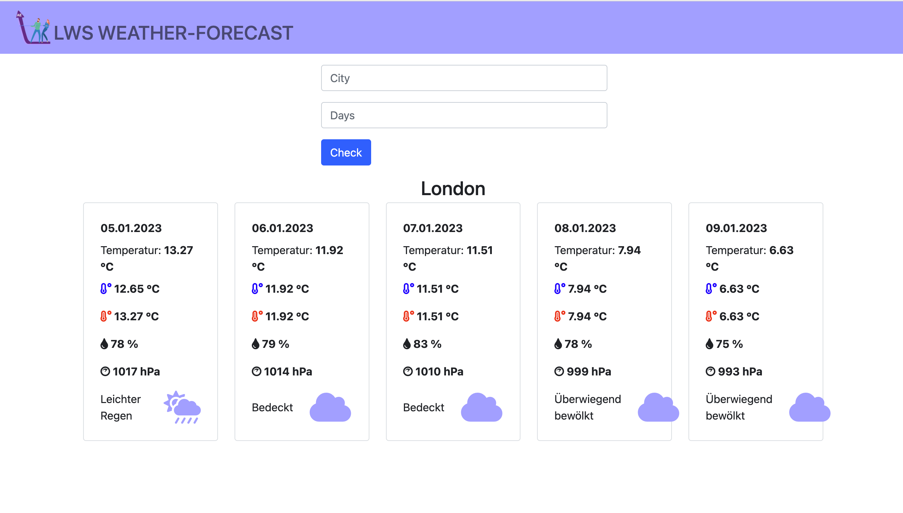

# Weather-Forecast

### Task

Erstelle eine Spring Boot-Anwendung namens "WeatherForecastApp", die mit Thymeleaf entwickelt wurde. Die App soll
Wettervorhersagen für einen bis drei Tage eines beliebigen Ortes als HTML-Webseite anzeigen.

### Vorbedingungen

Die Wetterdaten bezieht die Applikation von **https://openweathermap.org**. Dafür ist ein API-Key erforderlich, dieser
kann auf der Homepage von OpenWeatherMap, nach einer kostenfreien Registrierung, generiert werden.

Für diese Lerneinheit kann der folgenden Key verwendet werden:

### API_KEY = "b64102f327b1ea647b1c8e508bafac87"

Schaue dir die API-Dokumentation an und suche dir die passende API-Methode aus, mit der du die Daten für die
Wettervorhersage eines beliebigen Ortes für die nächsten drei Tage erhältst.

### Todo

- Erstelle ein neues Spring Boot-Projekt und füge Thymeleaf als Abhängigkeit hinzu.

- Erstelle eine HTML-Datei für die Wettervorhersage-Seite. Verwende Thymeleaf, um Platzhalter für die Wetterdaten
  einzufügen, die später dynamisch ersetzt werden. Du könntest beispielsweise für jeden Tag der Vorhersage eine Tabelle
  erstellen und Platzhalter für den Tag, das Datum, die Höchst- und Tiefsttemperaturen und den Wetterzustand einfügen.
- Erstelle ein JAVA Konsolenprogramm, das über die Konsole die Eingabe des Ortes für die Wettervorhersage anfordert.

- Erstelle eine Klasse namens WeatherForecastService, die eine Methode namens getForecast enthält, die
  Wettervorhersagedaten von einer externen API abruft und sie in einem Java-Objekt speichert.

- Erstelle eine Klasse namens WeatherForecastController, die eine Methode namens showForecast enthält. Diese Methode
  soll den Wettervorhersage-Service aufrufen, um die Wetterdaten abzurufen, und sie dann an die HTML-Seite übergeben.
  Verwende Thymeleaf, um die Wetterdaten in die HTML-Seite einzubinden und sie an den Benutzer zu senden.

- Konfiguriere eine URL, die auf die showForecast-Methode verweist, und teste die Anwendung, indem du auf die URL
  zugreifst. Die Wettervorhersage-Seite sollte angezeigt werden und die Wetterdaten der nächsten 5 Tage anzeigen.

### Hinweise:

Als HTTP-Client kannst du den HttpClient aus dem Java Package *java.net.http* verwenden.

Parse aus der Response des API-Aufrufs den Payload mit den Wetterdaten.

Um die Wetterdaten im JSON Format zu parsen, verwende die JSON Bibliothek **org.json:json:20210307**.

Nähere Information zur Nutzung der Bibliothek findest du unter *
*https://github.com/stleary/JSON-java/blob/master/Examples.md**

Mit den Daten aus dem JSON Dokument erzeuge folgende Ausgabe auf der Webseite:

- Den Ort für den die Wettervorhersage angefordert wurde

- Zeige für jeden Tag die folgenden Daten an:
    - Datum tt.mm.jjjj
    - Temperatur in °C
    - Min Temperatur in °C
    - Max Temperatur in °C
    - Luftfeuchtigkeit in %
    - Luftdruck in hPa (Hektopascal)
    - Das Wetter in Textform
- Verwende für die einzelnen Wetterdaten sinnvolle Icons/Iamges

- Reagiere auf die Eingabe eines falschen Ortes und Nicht-Erreichbarkeit des OpenWeatherMap Services mit entsprechenden
  Fehlermeldungen.

Die webseite könnte wie folgt aussehen:

### Stolperfallen

Achte darauf, dass auch Umlaute wie *ä,ö,ü,ß* korrekt behandelt werden, auch Ortsnamen, die aus mehr als
einem Wort (z.B. Schwäbisch Hall) bestehen müssen korrekt behandelt werden.

### Beabeitungszeit:

240 Minuten
