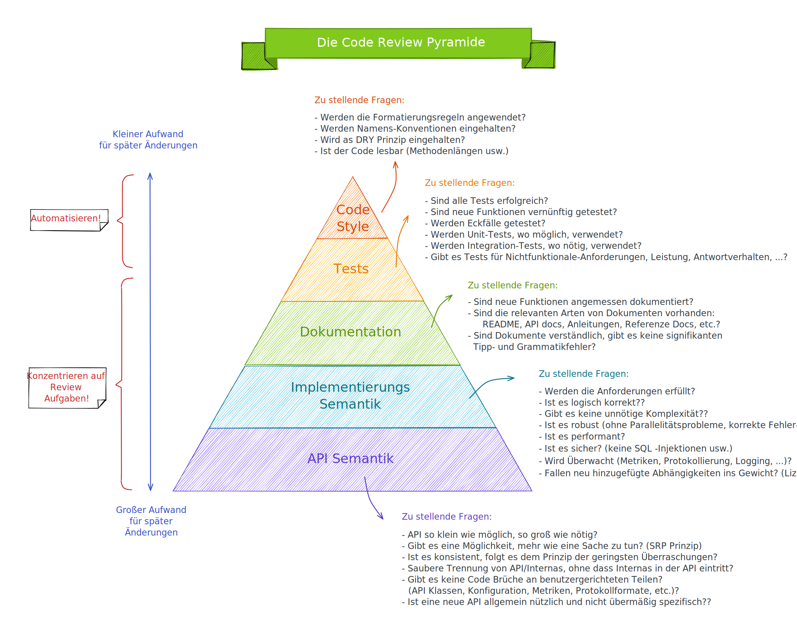

# Besser Programmieren

## Technische Schulden

Du musst schnell an einem Code-Projekt für eine Autovermietungsanwendung arbeiten und hast daher Abstriche bei
sinnvollen Variablen-, Funktions- und Klassennamen gemacht. Du hast stattdessen irgendwelche Namen genommen, um die
Arbeit schnell erledigen zu können und hast geplant, dich in einer späteren Version um die schlechten Namen zu kümmern.
Dies ist eine kleine technische Schuld, die du auf dich genommen hast, um die Arbeit schnell erledigen zu können.
Kurzfristig wirst du definitiv von technischen Schulden profitieren.

## Technische Schulden schaffen langfristige Probleme

Du hast in der ersten Iteration deines Code-Projekts Abstriche bei sinnvollen Variablen-, Funktions- und Klassennamen
gemacht, um die Arbeit schnell erledigen zu können und hast geplant, dich in der nächsten Iteration um die schlechten
Namen zu kümmern. In der zweiten Iteration musst du dich jedoch mit GPS-Problemen auseinandersetzen und hast keine Zeit,
dich um die technischen Schulden (die schlechten Namen) zu kümmern. Wenn du diese Schulden nicht bald abträgst, können
sie sich anhäufen und zu größeren Problemen wie verpassten Fristen führen. Es ist wichtig, technische Schulden so
schnell wie möglich anzugehen, auch wenn es kurzfristig Zeit kostet, um längerfristige Probleme zu vermeiden.

## Wahrheiten über Code Reviews

Wenn du während deiner Ausbildung den Code deines Ausbilders kopierst und auf die Ergebnisse deines Codes beurteilt
wirst, kannst du fälschlicherweise glauben, dass du der beste Programmierer bist und deine Codebasis niemals
unordentlich machst. Aber wenn du professionell programmierst, wirst du merken, dass Code-Reviews, bei denen dein Code
von anderen überprüft wird, wichtig sind. Neue Programmierer beschweren sich oft über den Code-Review-Prozess, verstehen
aber nicht, wie wichtig er auf lange Sicht ist. Sie haben während ihrer Ausbildung nie gelernt, die Bedeutung von
Code-Reviews zu verstehen.

## Dank Code-Reviews werden keine Bugs in die Codebasis eingeführt.

Code-Reviews verlangsamen die Entwicklungsgeschwindigkeit und machen es schwierig, neuen Code in die Codebasis
einzufügen. Trotzdem haben viele Unternehmen einen Code-Review-Prozess, da er viele Vorteile bietet. Prüfer überprüfen
beim Code-Review neuen Code, um sicherzustellen, dass er korrekt getestet wurde und funktioniert, wie er soll.
Code-Reviews helfen auch, künftige Fehler leicht zu finden und somit zukünftigen Ingenieuren Zeit für Fehlersuche und
Tests zu sparen.

## Verbesserung der Lesbarkeit des Codes

Code-Reviewer sorgen dafür, dass die Änderungen am Code leicht verständlich sind. Da der Code in der Zukunft häufiger
gelesen wird als bei seiner Erstellung, ist es wichtig, dass der Code-Reviewer dem Entwickler angemessenes Feedback
gibt, um den Code verständlicher zu machen.

## Vorteile der funktionalen Programmierung

In den meisten Programmierkursen wird hauptsächlich objektorientierte Programmierung (OOP) gelehrt, was die Codebasis
komplex erscheinen lässt und Entwickler dazu bringt, sich mit "Entwurfsmustern" und "Abstraktionen" statt mit der Lösung
von Problemen zu beschäftigen. Funktionale Programmierung ist eine gute Alternative zu OOP, bei der man ein Programm
ausschließlich mit Hilfe von Funktionen schreibt. Funktionale Programmierung führt zu sicheren Gleichzeitigkeiten,
einfacheren Tests und dem Debuggen von Code macht Spaß. Sie werden sich nicht mehr wie beim Debuggen von OOP-Code
verirren. Ein Beispiel für einen Vorteil von funktionaler Programmierung ist.

__Nachteile der unsauberen Funktion__

```
let xyz = 1;

function multiplyNumber(num){
    xyz = xyz * num;
    return xyz;
}
```

Die obige Funktion multiplyNumber() liefert nicht das gleiche Ergebnis, wenn sie mehrfach aufgerufen wird.

```
multiplyNumber(2);
console.log(multiplyNumber(2));
```

Ich habe multiplyNumber() zweimal aufgerufen. Die erzeugte Ausgabe ist 4.

Die obige Funktion "multiplyNumber()" ist eine unreine Funktion, die eine Variable außerhalb ihres Anwendungsbereichs
ändern kann. Selbst wenn die Eingabe gleich bleibt, ändert sich die Ausgabe jedes Mal, wenn die Funktion aufgerufen
wird.

__Vorteil reiner Funktionen__

Eine reine Funktion ist ähnlich wie eine mathematische Funktion und führt Berechnungen durch. Ein Beispiel für eine
reine Funktion ist:

```
function pureMultiply(num1, num2) {
  return num1 * num2;
}
```

Reine Funktionen sind deterministisch, das heißt, sie geben immer das gleiche Ergebnis zurück, wenn sie mit den gleichen
Eingabewerten aufgerufen werden. Die funktionale Programmierung hat weitere Vorteile gegenüber der imperativen
Programmierung. Es ist unklar, warum in den meisten Programmierkursen keine Konzepte der funktionalen Programmierung
gelehrt werden.

## Den Code anderer lesen

In keinem Programmierkurs wird gelehrt, wie man den Code anderer Entwickler liest, wodurch es für Anfänger schwierig
wird, den Code anderer zu verstehen. Es kann sogar schwierig sein, Dokumentationen zu lesen. Am Anfang hatte ich große
Schwierigkeiten beim Lesen von fremden Code und wurde schnell müde. Ich wollte alles neu schreiben, ohne den Kontext zu
verstehen. Mit der Zeit habe ich Techniken entwickelt, um den Code anderer besser zu verstehen und mich weniger zu
langweilen. Durch das Lesen von Code anderer Leute kann man anders über Probleme nachdenken und auch aus schlechtem Code
lernen.

__Wenn Sie den schlechten Code lesen, können Sie Fragen stellen wie:__

- Warum ist der Code so schwer zu lesen?
- Ist der Code nicht korrekt formatiert?
- Weist der Code doppelte Segmente auf?
- Ist das gewählte Entwurfsmuster falsch?
- Weist die Codebasis schlechte Klassen-, Funktions- und Variablennamen auf?

Indem du die richtigen Fragen stellst, kannst du herausfinden, was der vorherige Entwickler falsch gemacht hat, wodurch
der Code schwer zu lesen wurde. Wenn du selbst mit dem Schreiben von Code beginnst, weißt du, welche Fehler zu vermeiden
sind, um deinen Code leicht lesbar zu halten. Es ist wichtig, nicht einfach schlechten Code zu ignorieren. Wenn in
Programmierkursen mehr darauf geachtet würde, anderen Code zu lesen und zu verstehen, hätten viele Entwickler weniger
Schwierigkeiten damit.

__Die Code-Review Pyramide__

Die Code-Review Pyramide ist ein Konzept, das beschreibt, wie viel Zeit und Mühe auf verschiedene Aspekte einer
Code-Review verwendet werden sollte.

Die Pyramide besteht aus drei Ebenen:

- Basis: Einfache, technische Dinge wie Syntaxfehler, Code-Formatierung und dergleichen sollten schnell und automatisiert
geprüft werden. Diese Ebene nimmt den größten Teil der Zeit einer Code-Review in Anspruch.
- 
- Mitte: Die mittlere Ebene umfasst Design- und Architekturprobleme. Diese Probleme erfordern etwas mehr Zeit und Mühe, um
zu prüfen und zu lösen.
- 
- Spitze: Die oberste Ebene der Pyramide umfasst komplexere, strategische Überlegungen wie die langfristige Wartbarkeit
und Skalierbarkeit des Codes. Diese Probleme erfordern viel Zeit und Mühe, um zu prüfen und zu lösen.

- Das Konzept der Code-Review Pyramide schlägt vor, dass die meiste Zeit und Mühe auf die Basis der Pyramide verwendet
wird, während weniger Zeit auf die mittlere und obere Ebene verwendet wird. Dies bedeutet, dass Code-Reviews
hauptsächlich darauf konzentriert sein sollten, sicherzustellen, dass der Code einfach zu verstehen und zu pflegen ist,
anstatt sich auf komplexere, strategische Überlegungen zu konzentrieren.



## Zusammenfassung

- Keine trivialen Kommentare schreiben.
- Wie man mit technischen Schulden umgeht.
- Die Bedeutung von Code Reviews.
- Vorteile der funktionalen Programmierung.
- Lesen des Codes eines anderen Entwicklers.
- Die Code-Review Pyramide hilf bei der Beurteilung von Code-Reviews. 
