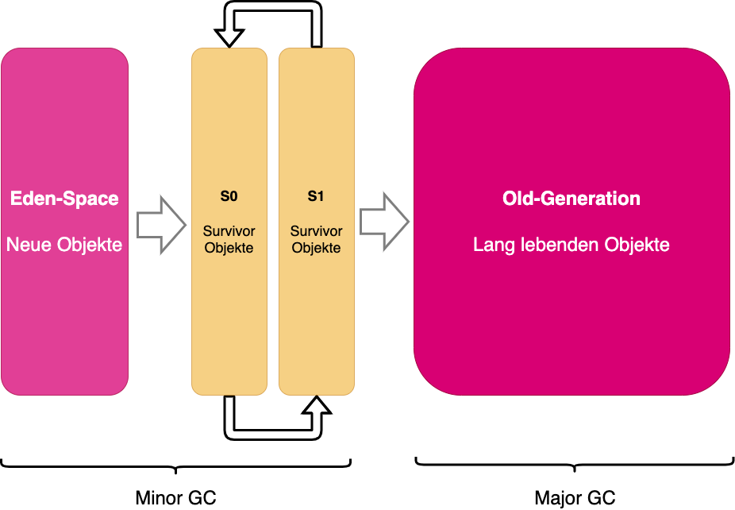
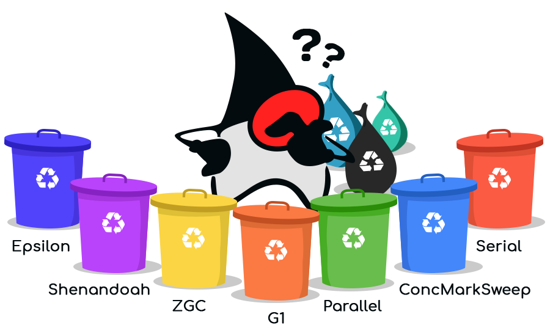

# Garbage Collection

Garbage Collection ist eine Technik, die dafür sorgt, dass ungenutzter Speicherplatz wieder verwendet werden kann. Dazu
sucht sie nach Datenobjekten, die nicht mehr benötigt werden und gibt den belegten Speicherplatz frei.

## Garbage Collector

Der Java Garbage Collector (GC) ist ein automatisierter Prozess, der dafür sorgt, dass der Speicher von Java-Anwendungen
effizient genutzt wird. Er durchsucht den Heap (den Speicherbereich, in dem Java-Objekte gespeichert werden), um
unbenutzte Objekte zu finden und deren Speicherplatz freizugeben.

Die Java Virtual Machine (JVM) verfügt über mehrere verschiedene Garbage Collector-Algorithmen, die für unterschiedliche
Anforderungen geeignet sind. Beispielsweise gibt es GC-Algorithmen, die besonders gut für Anwendungen mit vielen
kurzlebigen Objekten geeignet sind, und andere, die besser für Anwendungen mit wenigen, aber sehr großen Objekten
geeignet sind.

Der GC wird von der JVM automatisch gestartet, wenn der Speicherbedarf eine bestimmte Schwelle überschreitet. Während
des GC-Laufs werden alle erreichbaren Objekte markiert, während die unerreichbaren Objekte freigegeben werden. Ein
Objekt ist erreichbar, wenn es von einer "GC-Root" (z.B. einer lokalen Variablen oder einem statischen Feld) aus
erreichbar ist. Sobald der GC-Lauf abgeschlossen ist, werden alle freigegebenen Objekte aus dem Heap entfernt und der
freigewordene Speicher wieder verfügbar gemacht.

Der GC kann eine leistungsintensive Aufgabe sein und kann daher Auswirkungen auf die Leistung und die Antwortzeiten von
Java-Anwendungen haben. Daher ist es wichtig, dass Entwickler die Leistungsauswirkungen des GC im Auge behalten und
gegebenenfalls die GC-Einstellungen anpassen, um die Leistung ihrer Anwendungen zu verbessern.

Eden Space, Old Generation und Survivor Space sind Begriffe, die im Zusammenhang mit der Java Virtual Machine (JVM) und
dem Garbage Collector (GC) verwendet werden. Sie beziehen sich auf die Speicherbereiche, in denen Java-Objekte innerhalb
des Heaps (dem Speicherbereich, in dem Java-Objekte gespeichert werden) gespeichert werden.

Der Eden Space ist der Speicherbereich, in dem neu erstellte Java-Objekte zunächst gespeichert werden. Wenn der Eden
Space voll ist, wird der GC gestartet und unbenutzte Objekte werden aus dem Eden Space entfernt. Die verbleibenden
Objekte werden dann in den Survivor Space verschoben.

Der Survivor Space ist der Speicherbereich, in den Java-Objekte aus dem Eden Space verschoben werden, nachdem sie vom GC
markiert wurden. Wenn ein Objekt im Survivor Space lange genug überlebt hat (d.h. es wurde vom GC nicht als unbenutzt
markiert), wird es in den Old Generation (auch als Tenured Generation bezeichnet) verschoben.

Der Old Generation ist der Speicherbereich, in dem Java-Objekte gespeichert werden, die länger im System verbleiben. Der
Old Generation wird seltener vom GC durchsucht als der Eden Space und der Survivor Space, da es davon ausgegangen wird,
dass Objekte in diesem Bereich länger benötigt werden. Wenn der Old Generation voll wird, wird der GC gestartet und
unbenutzte Objekte werden entfernt.

## Garbage Collector Typen

## G1 GC (-XX:+UseG1GC)

Der Garbage-First (G1) ist ein Garbage Collector im Server-Stil für Multiprozessor-Maschinen mit einer großen Menge an
Speicher. Der Heap ist in Regionen fester Größe partitioniert und G1 verfolgt die Live-Daten in diesen Regionen. Wenn
Garbage Collection erforderlich ist, wird zuerst in den Regionen mit weniger aktiven Daten gesammelt.

## Shenandoah GC (-XX:+UseShenandoahGC)

Der Shenandoah GC ist ein Concurrent Garbage Collector für die JVM. Parallel bedeutet, dass der GC versucht, die meisten
Aktivitäten
parallel auszuführen, ohne die Anwendungsleistung zu unterbrechen. Durch diese Parallelität werden die "Stop-the-World"
-Pausen (STW), die für jeden GC die wichtigste Aufgabe sind, extrem kurz. Ein weiterer inhärenter Vorteil ist die
effiziente Arbeit mit kleinen und großen Heaps ohne Auswirkungen auf die Länge der STW-Pausen. Der Shenandoah GC
verwendet eine zusätzliche Option -XX:ShenandoahGCHeuristics=compact.

## ZGC (-XX:+UseZGC)

Der ZGC ist ein skalierbarer Garbage Collector mit geringer Latenz. Er wurde für Anwendungen entwickelt, die einen
großen Heap und eine geringe Latenzzeit erfordern. Er verwendet ein Bündel von einer Generation und führt die meisten (
aber nicht alle) Garbage Collection parallel zur ununterbrochenen Arbeit der Anwendung durch. Dadurch werden die
Auswirkungen der Garbage Collection auf die Antwortzeit Ihrer Anwendung stark eingeschränkt. Die ZGC verwendet eine
zusätzliche Option -XX:ZCollectionInterval=$ZCOLLECTION_INTERVAL, um das maximale Intervall (in Sekunden) zwischen zwei
GC-Zyklen festzulegen (kann über die Variable ZCOLLECTION_INTERVAL neu definiert werden).

## Epsilon GC (-XX:+UseEpsilonGC)

Der Epsilon GC ist ein passiver GC, der die Speicherzuweisung verwaltet und den Speicher nicht löscht, wenn Objekte
nicht mehr verwendet werden. Wenn Ihre Anwendung den Java-Heap erschöpft, schaltet sich die JVM ab. EpsilonGC verlängert
also die Lebensdauer einer Anwendung, bis der Speicher erschöpft ist, und löscht den Speicher, was für das Debuggen der
Speichernutzung einer Anwendung sowie für die Messung und Verwaltung der Anwendungsleistung nützlich sein kann.

## Parallel ParNew GC (-XX:+UseParNewGC)

Der ParNew GC ist ein "stop-the-world" multithreaded Garbage Collector. Er dient hauptsächlich dazu, die Objekte der
jungen Generation zu sammeln. Da die junge Generation normalerweise klein ist, führt ParNew die Sammlung sehr schnell
durch und beeinträchtigt Ihre Anwendung nicht allzu sehr. Darüber hinaus verfügt ParNew über eine Verdichtung des
ungenutzten Arbeitsspeichers, die eine automatische vertikale Skalierung ermöglicht.

## Parallel Parallel GC (-XX:+UseParallelGC)

Der Parallel GC wird verwendet, wenn die parallele Sammelmethode nur für die junge Generation erforderlich ist. Sie kann
im Gegensatz zu ParNew GC nicht gleichzeitig mit ConcMarkSweep GC angewendet werden.

## ConcMarkSweep GC (-XX:+UseConcMarkSweepGC)

Der ConcMarkSweep GC ist für Anwendungen konzipiert, die kürzere Garbage-Collection-Pausen bevorzugen und die es sich
leisten können, Prozessorressourcen mit dem Garbage-Collector zu teilen, während die Anwendung läuft. Es ist sinnvoll,
einen solchen Kollektor zu verwenden, wenn die Anforderungen der Anwendungen an die Dauer der Garbage Collection-Pausen
gering sind.

## Serial GC (-XX:+UseSerialGC)

Der Serial GC führt die Garbage Collection in einem einzigen Thread durch und hat den geringsten Speicherverbrauch unter
allen GC-Typen, macht aber gleichzeitig lange Pausen, die zu Leistungseinbußen der Anwendung führen können.

