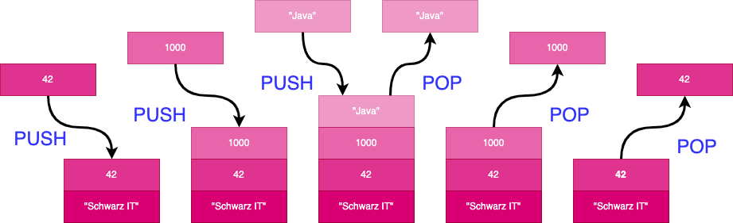
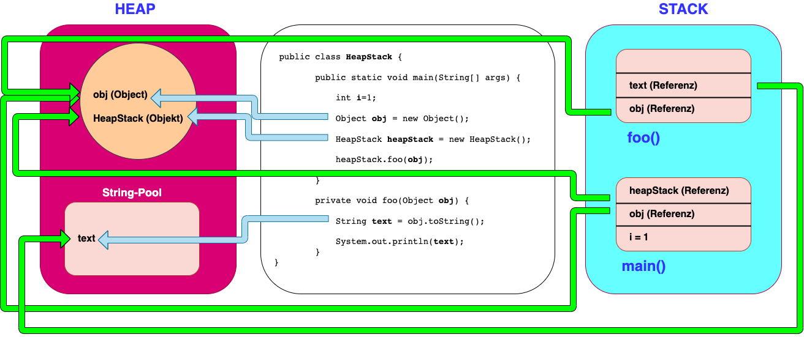

# Stack und Heap

In Java gibt es sowohl einen Stack als auch einen Heap, die beide von der Java Virtual Machine (JVM) verwendet werden,
um Code auszuführen.

## Stack

Der Stack ist ein spezieller Bereich im Hauptspeicher, in dem Daten temporär gespeichert werden, während der Code
ausgeführt wird. Jedes Mal, wenn eine Methode aufgerufen wird, wird ein neuer Eintrag (auch als "Frame" bezeichnet) im
Stack erstellt, der die lokalen Variablen, den Rücksprungpunkt (der angibt, wo der Code fortgesetzt werden soll, wenn
die Methode beendet ist) und ggf. andere Informationen enthält. Der Stack wird verwendet, um die Reihenfolge der
Methodenaufrufe zu verfolgen und um sicherzustellen, dass die richtigen Variablen und Werte zur Verfügung stehen, wenn
sie von der Methode benötigt werden.

Dazu schaffen wir sie erst einmal auf eine Palette und stapeln sie dort. Dieser Stapel ist der Stack und unsere Kartons
sind die Funktionen unseres Programms. Immer, wenn wir nun eine Kiste auf die andere stapeln, verlieren wir den Zugriff
zur vorherigen und können erst wieder auf diese zugreifen, wenn wir die darauf liegende herunternehmen. Diesen Umstand
nennt man das Last-in-First-Out Prinzip.

Das Last-in-First-Out-Prinzip (LIFO) beschreibt das Verhalten eines Stacks, bei dem das zuletzt hinzugefügte Element als
erstes entfernt wird. Dieses Prinzip wird auch als "First Out Last In" (FOLI) bezeichnet.

Ein Stack ist eine abstrakte Datenstruktur, die verwendet wird, um Elemente in einer bestimmten Reihenfolge zu speichern
und zu verarbeiten. Stacks werden häufig verwendet, um Methodenaufrufe in einem Programm zu verfolgen oder um die
Rekursion von Algorithmen zu implementieren.

### LIFO-Prinzip

Das LIFO-Prinzip bedeutet, dass das zuletzt hinzugefügte Element als erstes entfernt wird. Wenn zum Beispiel ein Stack
mit den Elementen "Schwarz IT", 42, 1000 und "Java" erstellt wird, würde das Entfernen der Elemente in der folgenden
Reihenfolge erfolgen:
"Java", 1000, 42, "Schwarz IT".



Das LIFO-Prinzip wird häufig in Stacks verwendet, da es einfach zu implementieren ist und sich gut für bestimmte
Anwendungen eignet. Beispiele für solche Anwendungen sind die Verwaltung von Methodenaufrufen in einem Programm oder die
Implementierung von Algorithmen, die eine Rekursion verwenden.

## Heap

Der Heap ist ein Bereich im Hauptspeicher, in dem dynamisch allokierten Speicherplatz verwaltet wird. Objekte in Java
werden im Heap gespeichert, der von der JVM verwaltet wird. Der Heap wird verwendet, um Speicherplatz für langlebige
Objekte bereitzustellen, die über den Lebenszyklus einer Methode hinaus benötigt werden.

Es ist wichtig zu beachten, dass der Stack in Java für die Speicherung von lokalen Variablen und die Verfolgung von
Methodenaufrufen verwendet wird, während der Heap für die Speicherung von Objekten verwendet wird. Im Gegensatz zu
einigen anderen Programmiersprachen gibt es in Java keine explizite Möglichkeit, Speicherplatz im Stack zu allokieren.
Stattdessen muss der Speicherplatz für lokale Variablen automatisch vom Compiler bereitgestellt werden.



## Funktionsaufruf
                 
```java
public class Main {
    public static void main(String[] args) {
        // Aufruf der Methode printMessage mit dem Argument "Java is awesome!"
        printMessage("Java is awesome!");
    }

    public static void printMessage(String message) {
        // Ausgabe der Nachricht
        System.out.println(message);
    }
}
```

In diesem Beispiel wird die printMessage-Methode mit dem Argument `Java is awesome!` aufgerufen. Wenn die
printMessage-Methode aufgerufen wird, wird ein neuer Frame im Stack erstellt, der die lokale Variable message enthält.
Die Methode wird ausgeführt und die Nachricht wird ausgegeben. Wenn die Methode beendet ist, wird der Frame aus dem
Stack entfernt und der Code kehrt zum Aufrufer (in diesem Fall main) zurück.

## Hauptunterschiede zwischen Stack- und Heap-Zuweisungen

| Parameter              | Stack                                                                                                                   | Heap                                                                                                                                                                                     |
|------------------------|-------------------------------------------------------------------------------------------------------------------------|------------------------------------------------------------------------------------------------------------------------------------------------------------------------------------------|
| Anwendung              | Der Stapel wird während der Ausführung eines Threads in Teilen verwendet, einer nach dem anderen                        | Die gesamte Anwendung verwendet während der Laufzeit Heap-Speicher                                                                                                                       |                                                                                                             
| Größe                  | Stack hat je nach Betriebssystem Größenbeschränkungen und ist normalerweise kleiner als Heap                            | Es gibt keine Größenbeschränkung für Heap (ausser der pysikalische Speichergröße)                                                                                                        |                                                                                                                                         
| Speicher               | Speichert nur primitive Variablen und Verweise auf Objekte, die im Heap Space erstellt werden                           | Alle neu erstellten Objekte werden hier gespeichert                                                                                                                                      |                                                                                                                              
| Bestellung             | Der Zugriff erfolgt über das Last-in-First-out (LIFO) Speicherzuweisungssystem.                                         | Der Zugriff auf diesen Speicher erfolgt über komplexe Speicherverwaltungstechniken, zu denen die Young Generation, die Old oder Tenured Generation und die Permanent Generation gehören. |       
| Existenz               | Der Stapelspeicher ist nur so lange vorhanden, wie die aktuelle Methode ausgeführt wird.                                | Heap-Speicher ist vorhanden, solange die Anwendung läuft                                                                                                                                 |                                                                                                                              
| Wirkungsgrad           | Im Vergleich zum Heap viel schneller zuzuordnen                                                                         | Langsamere Zuweisung im Vergleich zu Stack                                                                                                                                               |                                                                                                                                                                                     
| Zuweisung/Deallokation | Dieser Speicher wird automatisch zugewiesen und freigegeben, wenn eine Methode aufgerufen wird bzw. zurückgegeben wird. | Heap-Speicherplatz wird zugewiesen, wenn neue Objekte erstellt werden, und vom Gargabe Collector freigegeben, wenn sie nicht mehr referenziert werden.                                   | 